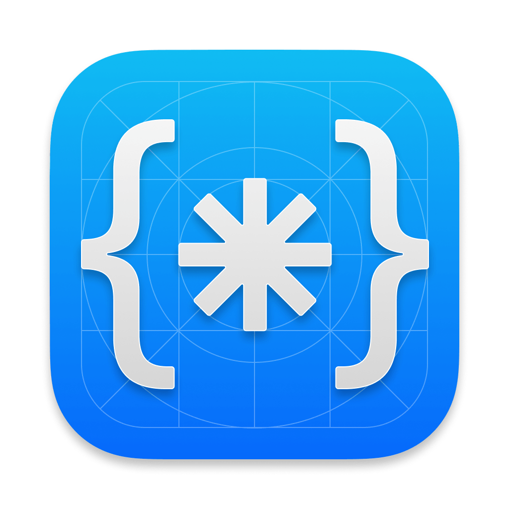

<h3 align="center">
  <a href="https://codeguide.co/">
    
  </a>
  <br>
  Code Guide
</h3>

<p align="center" markdown="1">
  Standards for developing consistent, flexible, and sustainable HTML and CSS.
  <br>
  <a href="https://codeguide.co"><strong>Start reading ☞</strong></a>
</p>

---

## Setup

Code Guide is built on Jekyll and hosted on GitHub Pages. To install Jekyll:

```sh
gem install jekyll
```

To start the local server:

```sh
jekyll serve
```

Open `localhost:4000` in your browser.

## License

Released under MIT by, and copyright, @mdo.

## Translations

Translations are maintained by their creators and may not always be up to date with the original here.

- [Chinese](http://zoomzhao.github.io/code-guide/) - Translated by [Zoom Zhao](https://github.com/ZoomZhao)
- [Chinese](http://codeguide.bootcss.com/) - Translated by [Wang Sai](https://github.com/wangsai)
- [Dutch](http://chunfeilung.github.io/code-guide/) - Translated by [Chun Fei Lung](https://github.com/chunfeilung)
- [French](http://pixelastic.github.io/code-guide/) - Translated by [Tim Carry](https://github.com/pixelastic/)
- [German](http://BackendButters.github.io/code-guide/) - Translated by [BackendButters](https://github.com/BackendButters)
- [Hindi](https://hidaytrahman.github.io/code-guide/) - Translated by [Hidaytullah Rahmani](https://github.com/hidaytrahman)
- [Indonesian](http://diagramatics.github.io/code-guide-id) - Translated by [Steven Sinatra](http://diagramatics.me)
- [Japanese](http://kia-king.com/code-guide/) - Translated by [Kia King Ishii](https://github.com/kiaking)
- [Korean](http://code-guide.aliencube.org/) - Translated by [Aliencube](https://github.com/aliencube)
- [Persian](https://cg.arash-hatami.ir/) - Translated by [Arash Hatami](https://github.com/hatamiarash7)
- [Polish](http://bondarewicz.github.io/code-guide/) - Translated by [Łukasz Bondarewicz](https://github.com/bondarewicz)
- [Portuguese](http://diegoeis.github.io/code-guide/) - Translated by [Diego Eis](http://tableless.com.br/)
- [Romanian](http://vmazare.github.io/code-guide-romanian/) - Translated by [Valeriu Mazare](https://github.com/vmazare)
- [Russian](http://sadcitizen.github.io/code-guide/) - Translated by [Eugene Abrosimov](https://github.com/sadcitizen)

Have a translation you'd like to link to? Open a pull request to add it here. Be sure to keep it alphabetical.

<3
